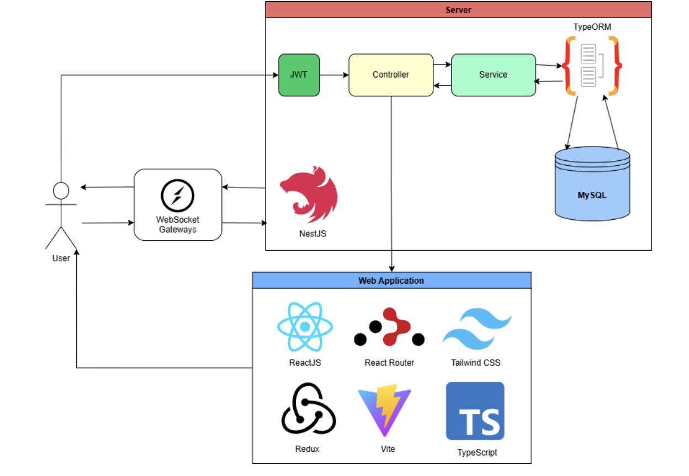

# Pet Owner Social Media

A social media platform for pet owners to connect, share posts, and interact with other pet lovers. This project is built using **React** (with TypeScript) for the frontend and **NestJS** for the backend.

## Features

- User Management: Register, log in, manage profiles, and friendships.
- Content & Interaction: Create posts, comment, message, and join groups.
- Pet & Community: Add pets, engage in groups, and connect with others.
- Moderation & Reporting: Report issues, manage users, and review content.
- Analytics & Insights: Track activity, engagement, and system statistics.

## Database Schema


## System Architecture



## Tech Stack

### Frontend

- React
- TypeScript
- Redux Toolkit
- Axios
- React Router
- Socket.IO
- Tailwind CSS

### Backend

- NestJS
- TypeORM
- MySQL
- JWT
- Socket.IO

## Installation

### Backend (NestJS)

1.  Clone the repository:

    ```bash
    git clone https://github.com/your-username/pet-owner-social-media.git

    cd pet-owner-social-media
    ```

2.  Navigate to the server directory:

    ```bash
    cd server
    ```

3.  Install dependencies:

    ```bash
    npm install
    ```

4.  Create a `.env` file in the `server` directory and configure the following environment variables:

    ```bash
    DATABASE_URL=your-database-connection-string
    JWT_ACCESS_SECRET=your-jwt-secret
    ```

5.  Run the backend server:

    ```bash
    npm run start:dev
    ```

### Frontend (React + TypeScript)

1. Navigate to the client directory:

    ```bash
    cd client
    ```

2. Install dependencies:

    ```bash
    npm install
    ```

3. Run the frontend application:

    ```bash
    npm start
    ```

4. Visit `http://localhost:3000` in your browser.

## Usage

-   Once both the frontend (`client`) and backend (`server`) servers are running, you can start interacting with the app by registering as a new user, adding pets to your profile, creating posts, commenting, and connecting with other pet owners.
-   You can also create and join groups, send friend requests, and report inappropriate content,...
